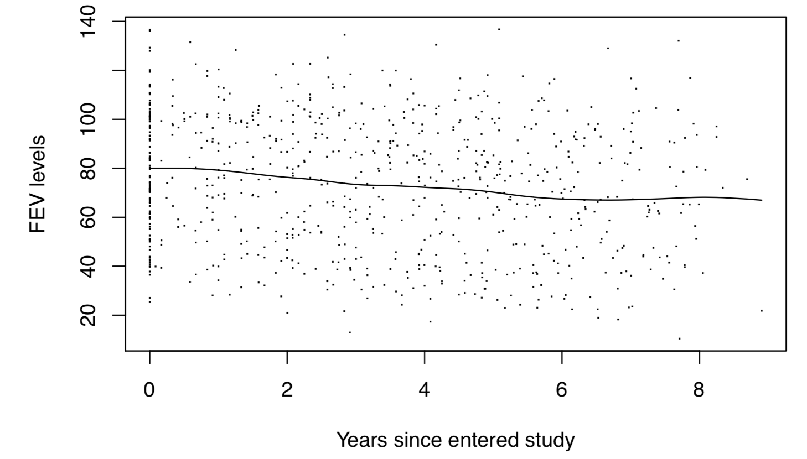
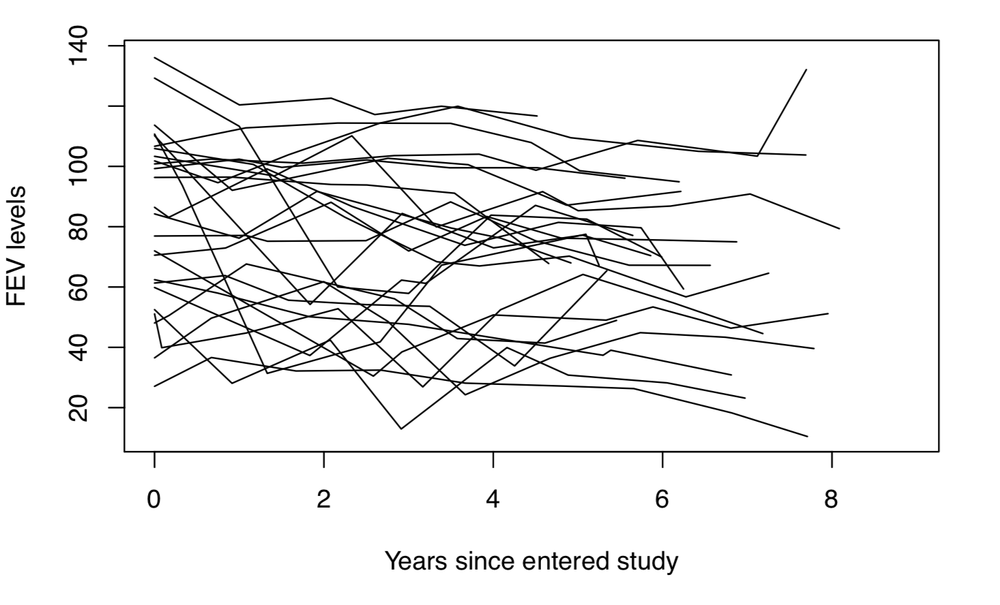

```{r libraries and data loading, echo=FALSE}

#### LOAD LIBRARIES ####
#install.packages('splines')
#install.packages('gee')
#install.packages('survival')
#install.packages('nlme')
#install.packages('lme4')

library(splines)
library(gee)
library(survival)
library(nlme)
#library(lme4)

#### FUNCTIONS WE NEED ####
glmCI.long <- function (model, transform = TRUE, robust = FALSE) 
{
   link <- model$family$link
   coef <- summary(model)$coef[, 1]
   se <- ifelse1(robust, summary(model)$coef[,4], summary(model)$coef[, 
                                                                        2])
   zvalue <- coef/se
   pvalue <- 2 * (1 - pnorm(abs(zvalue)))
   if (transform & is.element(link, c("logit", "log"))) {
      ci95.lo <- exp(coef - qnorm(0.975) * se)
      ci95.hi <- exp(coef + qnorm(0.975) * se)
      est <- exp(coef)
   }
   else {
      ci95.lo <- coef - qnorm(0.975) * se
      ci95.hi <- coef + qnorm(0.975) * se
      est <- coef
   }
   rslt <- round(cbind(est, ci95.lo, ci95.hi, zvalue, pvalue), 
                 4)
   colnames(rslt) <- ifelse1(robust, c("Est", "robust ci95.lo", 
                                       "robust ci95.hi", "robust z value", "robust Pr(>|z|)"), 
                             c("Est", "ci95.lo", "ci95.hi", "z value", "Pr(>|z|)"))
   colnames(rslt)[1] <- ifelse(transform & is.element(link, 
                                                      c("logit", "log")), "exp( Est )", "Est")
   rslt
}

#### LOAD CLEAN DATA ####
house.edu <- read.csv('house_edu.csv', header=T)
house.edu <- house.edu[,-1]

food <- read.csv('food.InspectClean.csv', header=T)
food <- food[,-1]
```
### Introduction
So you've mastered the art of the linear regression, eh? You can build a multiple regression model with the best of them and interpret the coefficients like a pro. But what happens when you get data that *isn't* random and independent? 

Sometimes we have pockets or **clusters** of data in our dataset that are more similar to each other than they are to the rest of the dataset. In medical data, these could be patients that each came in several times to get their heartrate monitored; in more publicly available data, these could be average standardized test scores for several counties over 10 years. These all revolve around the idea that *datapoints from the same cluster are likely to behave similarly*.

We call data where people/cities/clusters have multiple datapoints **longitudinal data**, and in this tutorial we'll learn how to build appropriate models for them using R.  

*(Side note: longitudinal data is not the same as time series data. Longitudinal data usually has many clusters, where each have a few data points. Time series data usually has one cluster that has many, many observations. There are specific methods to model time series data that I won't go into in this tutorial.)*

### The Stats
Regular linear regression is what we like to call **Ordinary Least Squares (or OLS) regression**. This means if we have data **X** and responses $\vec{Y}$, our coefficeints $\vec{\beta}$ will be such that this equation holds:
$$\boldsymbol{X}^T(\vec{Y} - \boldsymbol{X}\vec{\beta}) = 0$$

This is what the R function *lm()* does!

OLS also comes with the assumption that:

1) All our observations/data points are *independent* of each other  
2) We're dealing with *Normally distributed* data  

These assumptions are all fine and good, but sometimes the data we work with aren't entirely independent (and sometimes not Normal, but we'll get to that later) .  

To model clustered or longitudinal data, we work with something called **Iteratively Reweighted Least Squares (IRLS)**. Sounds intimidating, but essentially we are just putting a weight on the equation that estimates our coefficients (those pesky $\beta$s) that accounts for the fact that we are no longer dealing with completely independent data points. Instead of the OLS equation we now need to satisfy the weighted least squares equation:
$$\boldsymbol{X}^T\boldsymbol{W}(\vec{Y} - \boldsymbol{X}\vec{\beta}) = 0$$
where $\boldsymbol{X}^T$ and $\boldsymbol{X}^T$ is our data, $\vec{Y}$ are our responses, $\vec{\beta}$ is our coefficients, and $\boldsymbol{W}$ are our weights.

Why do we care about these weights? Because when we use methods for independent data, there's no distinction between who the data belongs to and it all looks like one clump. Look at the plot below:


Doesn't look like much of a trend in those points, right? That's what a regular linear regression is seeing. Linear regression thinks each individual dot is a new study participant, when in fact study participants were measured multiple times. But by adding weights, we can account for within-cluster trends to better estimate the overall population trend. Here's what the trends of 25 random study participants look like:

Much more obvious that there is downward trends!

The R function *gee()* will account for the within-cluster trends for us later. But first, let's do some general data analysis.

### Continuous Longitudinal Data
#### Exploratory Data Analysis
For our first example, we will be dealing with median housing prices in Texas counties from 2009-2016. We would like to know if the percent of college graduates in a county affects median housing price. First let's plot everything and see if there's an initial trend:

```{r housing intial plot}
par(mfrow=c(1,1))
plot(house.edu$year, house.edu$Median,
     main="Overall Trend",
     xlab="Year",
     ylab="Median Home Value")
abline(lm(house.edu$Median ~ house.edu$yrsSince2009))
```

Looks like median home prices are steadily climbing. However, we have no sense of which home prices belong to which counties -- for all we know there could be no county that is observed twice. In actuality, we have 53 counties represented. And is it fair to say that median home values *within* each county are on the rise? Here's what the data looks like when we group by county:

```{r housing spaghetti plot}

par(mfrow=c(1,1))
plot( house.edu$year, house.edu$Median, pch=".",
      xlab="Year",
      ylab="Median Home Value",
      ylim=c(50000, 260000))
uid <- unique( house.edu$countyID )

for( j in seq( length(uid) ) ){
   lines(house.edu$year[ house.edu$countyID==uid[j] ],
         house.edu$Median[ house.edu$countyID==uid[j] ])
}
```
We call this a **spaghetti plot**, and each line represents a different county. Notice how some counties have prices that are consistently higher than all other counties, while others have prices that are consistently lower than all other counties. There are also some counties whose home values stay relatively flat while others increase more steeply. 

```{r housing forest plots}

house.edu.grouped <- groupedData( Median ~ yrsSince2009 | countyID,
                                  data=house.edu )

indiv.house.edu.lm <- lmList( Median ~ yrsSince2009 | countyID,
                        data=house.edu.grouped )

## creating forest plots of the intercepts & slopes of all the regressions ##
len <- length(indiv.house.edu.lm)
forest.matrix <- matrix(NA, nrow = len, ncol = 7)
forest.matrix[,1] <- names(indiv.house.edu.lm)
forest.matrix[,2] <- intervals(indiv.house.edu.lm)[1:len]
forest.matrix[,3] <- intervals(indiv.house.edu.lm)[(len+1):(2*len)]
forest.matrix[,4] <- intervals(indiv.house.edu.lm)[(2*len + 1):(3*len)]
forest.matrix[,5] <- intervals(indiv.house.edu.lm)[(3*len + 1):(4*len)]
forest.matrix[,6] <- intervals(indiv.house.edu.lm)[(4*len + 1):(5*len)]
forest.matrix[,7] <- intervals(indiv.house.edu.lm)[(5*len + 1):(6*len)]

par(mfrow = c(1,2))
plot( forest.matrix[1,2:4], rep(1, 3), type = "l", ylim = c(1, len),
      xlim=c(70000,210000),xlab = "Intercept",
      ylab= "Order of Intercept",
      cex.lab=0.8, cex.axis=0.7)
for( j in 1:length(unique(forest.matrix[,1]))){
   lines(forest.matrix[j,2:4], rep(j, 3))
   
}

plot( forest.matrix[1,5:7], rep(1, 3), type = "l", ylim = c(1, len),
      xlim=c(-200,12000), xlab = "Slope", ylab= "Order of Intercept",
      cex.lab=0.8, cex.axis=0.7)
for( j in 1:length(unique(forest.matrix[,1]))){
   lines(forest.matrix[j,5:7], rep(j, 3))
   
}
mtext("Random Intercepts & Slopes of Texas Median Home Values",
      outer=TRUE,line=-2, cex=0.9)

```
We call this a **forest plot**. This represents what the intercepts and slopes would be if we performed individual *lm()*s on the data from each county separately. If the data were truly independent, all the lines would be overlapping. But, on the left in the intercept plot, we have lines all over the place! This means we probably have a case for **random intercepts**, or that some counties start and and some counties start low (and probably stay that way). On the right, in the slope plot, the lines are less spread out but still not overlapping; this means we also have a case for **random slopes**, meaning that the trends of the individual counties may not be exactly the same. We'd like to account for these things in our model if we believe they are present, so to better estimate the overall population trend.

Now that we vaguely know what structure of data we're dealing with, we can move into modeling. First, though, let's learn more about the *gee()* function.

#### The *gee()* function
gee stands for **Generalized Estimating Equation**. 

Like with the *lm()* function, there are several arguments we need to fill in:

* **Formula**: this is the same formula you would plug in for *lm()*, of the form *response ~ variable1 + variable2 + ...*  
* **id**: this is a variable in your dataframe that identifies your clusters. If I have 12 patients with 3 datapoints each, each datapoint needs to have something that tells us which patient it is coming from. Usually this is done as the very first column of your dataframe, where the id can be a number or a string.  
* **data**: like with *lm()*, this is the name of your dataframe  
* **family**: the default for this argument is "gaussian"", which just means Normal. We generally won't put anything in for this argument unless we're dealing with binary data (we'll see this later).  
* **corstr**: this tells the function how we want to do our weights.  
      + There are 3 main options for this:  
      1) "independence": this is the default and will get us *lm()*
      2) "exchangeable": this gives us random intercepts
      3) "AR-M": this gives us random slopes and random intercepts. With this though, we also need to specify a "Mv" argument, which will be 1.

*Side note: two other popular functions for modeling longitudinal data are * lme() *from the* nlme *package, and* lmer() *from the* lme4 *package. These work similarly to the* gee() *function but have slightly different synatx and technically require stronger statistical assumptions to use. I generally stick to* gee()*.*


#### Modeling Continuous Longitudinal Data
Here's what we would get if we essentially did regular linear regression on the data, but using the *gee()* function:
```{r housing indep model, message=FALSE}
house.edu.gee.ind <- gee(Median ~ BApctTotPop18plus + yrsSince2009,
                         id=countyID,
                         data=house.edu,
                         corstr="independence")
```
```{r housing indep model coef}
summary( house.edu.gee.ind )$coef
```

Here's what we would get if we assumed random intercepts:
```{r housing exch model, message=FALSE}

house.edu.gee.exch <- gee(Median ~ BApctTotPop18plus + yrsSince2009,
                          id=countyID,
                          data=house.edu,
                          corstr="exchangeable")
```
```{r housing exch model coef}
summary( house.edu.gee.exch )$coeff

```

And here's what we would get if we assumed random slopes and random intercepts:
```{r housing AR-1 model, message=FALSE}
house.edu.gee.AR1 <- gee(Median ~ BApctTotPop18plus + yrsSince2009,
                         id=countyID,
                         data=house.edu,
                         corstr="AR-M",
                         Mv=1)
```
```{r housing AR-1 model coef}
summary( house.edu.gee.AR1 )$coeff
```
*(Now normally we would not build and run all three of these models: we would investigate the data beforehand to see if we can justify adjusting for random intercepts, or both random slopes and intercepts.)*

Let's interpret that last model:

* **yrsSince2009**: expected slope of median home value among counties with no college grads
* **BApctTotPop18plus**: expected difference in mean median home value in 2009 comparing sub-groups of counties with 1 percentage point difference in college grads
      + i.e., counties with no college grads compared with counties where 1% of the 18+ population have at least a bachelors

Compare these results with what you would've gotten with a classic *lm()*. In the first model, it said counties where 1% of the 18+ population have at least a bachelors will raise median home value by \$5,606.52. Our third model, though, says median home value will only go up by \$473.58! Accounting for those random slopes and intercepts made a huge difference!

Obviously, if you were doing this analysis for real, you would want to include some confounding variables in there (as it's not hard to believe that median county home values depend on more than just how educated the population is), but this is a good simple example for demonstrating how *gee()* works.  

#### Robust Standard Error
You may notice in the output from the summary of the GEE that in addition to the "Estimate" column there are 4 other columns:

* **Naive S.E.**
* **Naive Z**
* **Robust S.E.**
* **Robust Z**

"Naive S.E." indicates the standard error for that coefficient if we assumed constant variance (what *lm()* assumes). Similarly, "Naive Z" is the Z statistic you would get if you used that standard error.  

However, we have reason to believe that different counties will have different variances. The Robust standard error (denoted "Robust S.E.") is a post-model fix-em-up for this problem. There's a lot of statistical theory that goes into this, but basically if the variances really don't differ by county you'll get something pretty close to the regular standard error, and if they do differ then this will help fix the variance. And, as you can imagine, the "Robust Z" is the Z statistic you would get if you used the Robust standard error.  

*BIG OLE ASTERISKS HERE THOUGH.* The Robust standard error *DOES NOT DO WELL* (i.e., it's unpredictable) when you have fewer than 50 independent clusters. If you have fewer than 50 clusters, it's safer to go with the regular standard error because at least we know *why* it's wrong.  

Using the Naive or Robust standard error won't change the point estimate of the coefficient, but using one or the other will effect your inference (i.e., the confidence intervals and whether the Z statistic says the coefficient is significant).

### Binary Longitudinal Data
#### Logistic Regression
In this example, we'll be working with Chicago health inspection data from 2010-2018. We'd like to see how being a fast food chain affects likelihood of failing health inspection.  

Unlike in the continuous example, where our "response" could be any number greater than or equal to 0, here our response is **binary**: 0 if the food handler passes inspection; 1 if the food handler fails inspection. Because our responses can technically only exist between 0 and 1, we can no longer say that our data are Normal anymore.  

Instead, we use something we call **logistic regression**, where our response is transformed by the **logit function**:
$$logit(\mu) = log(\frac{\mu}{1-\mu})$$

Before, our regressions were telling us something about the *mean* of the response; now, they are telling us something about the *log-odds*. 

#### Exploratory Data Analysis
Like with our continuous example, let's plot all the data together:  
```{r logit initial plot}
par(mfrow=c(1,1))
plot(food$timeSinceBaseline, food$fail,
     main="Overall Trend",
     xlab="Months Since First Inspection",
     ylab="Failing Inspection")
abline(lm(food$fail ~ food$timeSinceBaseline))
```
Looks like, as time goes on, overall, food handlers become less likely to fail inspection. Which is good!  

Because we're dealing with binary data, though, vizualizing the data can be a little tricky.  

#### Modeling Binary Longitudinal Data
Now we can move on to our models. This time, since our data are not Normal, we're going to put in *binomial(link='logit')* as the input ofr the *family* argument.  

Here's what we would get essentially with basic logistic regression:  
```{r logit indep, message=FALSE}
food.gee.ind <- gee(fail ~ chain + timeSinceBaseline,
                    id=License,
                    data=food,
                    family=binomial(link='logit'), # this is different from the continuous set!
                    corstr="independence")
```
```{r logit indep coef}
summary( food.gee.ind )$coef

```
Remember, though: these are the coefficients on that transformed logistic scale. They aren't super interpretable right now, so we're going to use a function I defined up at the top of the file that exponentiates the coefficients and their 95% confidence intervals.
```{r logit indep glmCI.long}
glmCI.long(food.gee.ind, robust=TRUE)
```

Here's what we would get if we assumed random intercepts:
```{r logit exch, message=FALSE}
food.gee.exch <- gee(fail ~ chain + timeSinceBaseline,
                     id=License,
                     data=food,
                     family=binomial(link='logit'), 
                     corstr="exchangeable")
```
```{r logit exch coef}
glmCI.long(food.gee.exch, robust=T)
```
Let's interpret the model with random intercepts:

* **chain**: the increased/decreased percentage likelihood of failure of a chain restaurant compared to another food handler at the same timepoint
      + if the exp( Est ) > 1, then the chain is (exp( Est ) - 1)(100)% *more* likely to fail
      + if exp( Est ) < 1, then the chain is (1 - exp( Est ))(100)% *less* likely to fail
      + Our's is 0.9035, so a chain restaurant is 9.65% *less* likely to fail inspection compared to another food handler at the same timepoint  

Let's also try to see we would get if we assumed random slopes and intercepts:
```{r logit AR-1, message=FALSE, error=T}
food.gee.AR1 <- gee(fail ~ chain + timeSinceBaseline,
                    id=License,
                    data=food,
                    family=binomial(link='logit'), 
                    corstr="AR-M",
                    Mv=1)
```
Yikes! This is a common error to run into. It's telling you that your data doesn't have enough clusters with more than two datapoints for *gee()* to be able to run a model with random slopes and intercepts. That's okay - we can just stick to the random intercepts model.